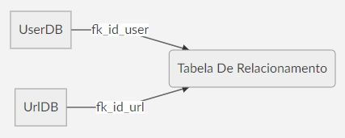

# Documentação big data challenge

# Introdução
Essa é uma aplicação de recomendação de documentos usando a abordagem de [Collaborative filtering](https://en.wikipedia.org/wiki/Collaborative_filtering).

A Filtragem Colaborativa não requer nenhuma informação sobre os itens ou sobre o próprio usuário. A ideia principal por trás da Filtragem colaborativa é que usuários semelhantes compartilham interesses semelhantes, pessoas com interesses semelhantes tendem a gostar de itens semelhantes. Portanto, esses itens são recomendados para um conjunto semelhante de usuários.
Nesse caso de uso, pretendemos recomendar links. Para isso, segmentaremos uma classificação padrão de links  para encontrar semelhança entre duas urls.

# Abordagem
Partimos da suposição de que se o usuário **A** viu os documentos 1, 2 e 3; o **B** viu 1, 2 e 5; e o **C** viu 1, 2 e 4, a API deve dizer que o documento 1 é similar ao 2.
 Mas como medimos a similaridade desses documentos? O algoritmo de recomendação implementado nesse programa usa a **similaridade dos cossenos**. Na similaridade dos cossenos analisamos a distância angular entre 2 pontos a partir da origem. A imagem abaixo ilustra como é calculado a similaridade dos cossenos:


A fórmula para se calcular a similaridade dos cossenos é dada por:


# O Sistema
### Aplicação
O sistema de recomendação foi desenvolvido em Scala usando a versão 2.12.8 e o JDK 8.
Principais bibliotecas usadas no projeto:

|        Biblioteca        |Link|Versão                         |
|----------------|-------------------------------|-----------------------------|
|Spark			 |https://spark.apache.org/            |2.4.4|
|Akka Streams	 |https://doc.akka.io/docs/akka/2.5/stream/  |2.5.25           |
|Akka-http		 |https://doc.akka.io/docs/akka-http/current/index.html|10.1.9|
|Doobie			 |https://tpolecat.github.io/doobie/|0.7.0|

Exemplo de entrada e resultado:
- Input
```
curl -X POST -H "Content-Type: application/json" -d "{\"user\":\"user1\"}" http://localhost:8080/www.teste.com.br/view/
curl -X POST -H "Content-Type: application/json" -d "{\"user\":\"user1\"}"  http://localhost:8080/www.think.com/view/
curl -X POST -H "Content-Type: application/json" -d "{\"user\":\"user1\"}" http://localhost:8080/www.testing.com.br/view/
curl -X POST -H "Content-Type: application/json" -d "{\"user\":\"user2\"}" http://localhost:8080/www.teste.com.br/view/
curl -X POST -H "Content-Type: application/json" -d "{\"user\":\"user2\"}" http://localhost:8080/www.think.com/view/
curl -X POST -H "Content-Type: application/json" -d "{\"user\":\"user2\"}" http://localhost:8080/www.different.com.br/view/
curl -X POST -H "Content-Type: application/json" -d "{\"user\":\"user3\"}" http://localhost:8080/www.teste.com.br/view/
curl -X POST -H "Content-Type: application/json" -d "{\"user\":\"user3\"}" http://localhost:8080/www.think.com/view/
curl -X POST -H "Content-Type: application/json" -d "{\"user\":\"user3\"}" http://localhost:8080/www.thinkdifferent.com/view/
```
- Output
```
curl http://localhost:8080/www.think.com/similar/
```
```json
[
  {
    "url": "www.teste.com.br",
    "score": 1.0
  }
]
```
```
Como podemos ver no exemplo acima, a api retorna as url's que são similares
ao link: www.think.com
```

Com a url similar encontrada acima:


```
curl http://localhost:8080/www.teste.com.br/similar/
```


```
[
  {
    "url":"www.think.com",
    "score":1.0
  }
]
```
### O algoritmo
Como já citado anteriormente, o algoritmo implementado para solucionar o problema de recomendação foi a similaridade dos cossenos, o algoritmo possui duas variáveis importantes que são cruciais para efetuar uma boa recomendação.
- **thresholdScore** => variável responsável por definir o limiar minimo de score.
- **thresholdOccurence** =>  variável responsável por definir o limiar minimo de ocorrências.
`'Essas variáveis devem ser ajustadas caso as recomendações estejam ruins. `


### Construção dos datasets
O armazenamento das informações fornecidas para a API foram guardadas em um banco de dados relacional e open source [PostgreSQL](https://www.postgresql.org/).
Foram criadas três tabelas para relacionar o usuário com a url, para que fosse possível de construir um dataset válido. A ilustração do relacionamento pode ser vista na imagem a seguir.




SQL para criação das tabelas:
```
-- URL table
CREATE TABLE public.url_access (
	id serial NOT NULL,
	link text not null ,
	CONSTRAINT url_access_pkey PRIMARY KEY (id),
	CONSTRAINT url_access_link_key UNIQUE (link)
);

-- USER Table
CREATE TABLE public.user_access (
	id serial NOT NULL,
	user_name varchar(120) null,
	CONSTRAINT user_access_pkey PRIMARY KEY (id),
	CONSTRAINT user_access_user_name_key UNIQUE (user_name)
);

-- RELATION Table
create table url_relation (
id serial not null,
id_user int8 not null,
id_url int8 not null,
rating int4 not null
);
ALTER TABLE public.url_relation ADD CONSTRAINT fk_id_user FOREIGN KEY (id_user) REFERENCES user_access(id);
ALTER TABLE public.url_relation ADD CONSTRAINT fk_id_url FOREIGN KEY (id_url) REFERENCES url_access(id);
```
No total são gerados dois datasets, o dataset de urls tem as informações de id e o link. O dataset de relacionamento é gerado com informações de id do usuario, id do link e o rate padrão de 1.0.


# Dificuldades
Como não existia dataset com informações previamente salvas, uma das maiores dificuldades encontradas nesse desafio foi encontrar uma forma simples de persistência das informações que seriam recebidas pela API e como efetuar a manipulação e o controle dos dados de entrada, para que fosse possível efetuar a recomendação dos links.
A falta de um dataset pré existente foi a principal motivação para a escolha do algoritmo de similaridade dos cossenos, para que fosse possível recomendar links mesmo com uma quantidade de informação limitada.


# Considerações
Mesmo tendo trabalhado antes com sistema de recomendação, esse projeto me fez refletir sobre o quão difícil é recomendar, de quanta certeza tem o algoritmo de estar recomendando o item corretamente e de também calcular se o item recomendado será satisfatório para o usuário.

Uma pergunta que me fiz enquanto realizava o desenvolvimento da aplicação foi: Porque a rota /view especificada no desafio recebe o link acessado pelo usuário na url? Porque não junto com o usuário no formanto json? como no exemplo abaixo:
> {
> "user" : "user1",
> "url" : "www.teste.com"
> }

Acredito que o mais correto e mais simples seria dessa forma.

## Melhorias a fazer
Devido ao curto prazo, alguns detalhes estão ausentes do projeto.
- Tratamento de exceção em alguns pontos que não foram mapeados.
- Fazer uma cobertura maior de teste unitário.
- Otimização do código.
- Desenvolver usando programação funcional, sem variáveis mutáveis.


## O estado da arte
A partir da leitura dos outros tópicos, percebe-se que a solução implementada nesse problema foi bastante simples, concisa e o objetivo era recomendar a partir de um dado conjunto de urls.

**Mas qual seria o estado da arte de um sistema de recomendação?**
> Essa pergunta é um tanto quanto complexa, vai depender bastante de quanto um sistema **gera informação**, **sua arquitetura**, **implementação**, **abordagem**, **algoritmo**, **inteligência**, **estratégia** etc.

Podemos perceber que é um conjunto de fatores que poderia melhorar um sistema de recomendação. Que ideias poderíamos implementar no projeto e como poderíamos fazer caso tivesse tempo suficiente e full time?
1. Geração de eventos e publicação no [Apache Kafka](https://kafka.apache.org/).
>Kafka é uma poderosa plataforma de streaming de dados para lidar com feeds de dados em tempo real.  O kafka seria usado para que fosse possível publicar eventos dos quais poderiam ser consumidos, transformados e enriquecidos por algum outro processo, afim de gerar informações através dos dados.

2. Gravação das informações no [Elasticsearch](https://www.elastic.co/guide/en/elasticsearch/reference/current/index.html).
>Bons sistemas de recomendação trabalham com uma grande massa de dados para que a recomendação seja a mais precisa possível. Análises teriam que ser feitas em cima dos dados de feedback do sistema de recomendação para estudar os resultados e tirar insights.
Então porque não usar um banco que carrega o poderoso [Apache Lucene](https://lucene.apache.org/) em seu núcleo?  Grande quantidade de informações teriam que ser persistida e o Elasticsearch funcionaria perfeitamente para esse cenário.
